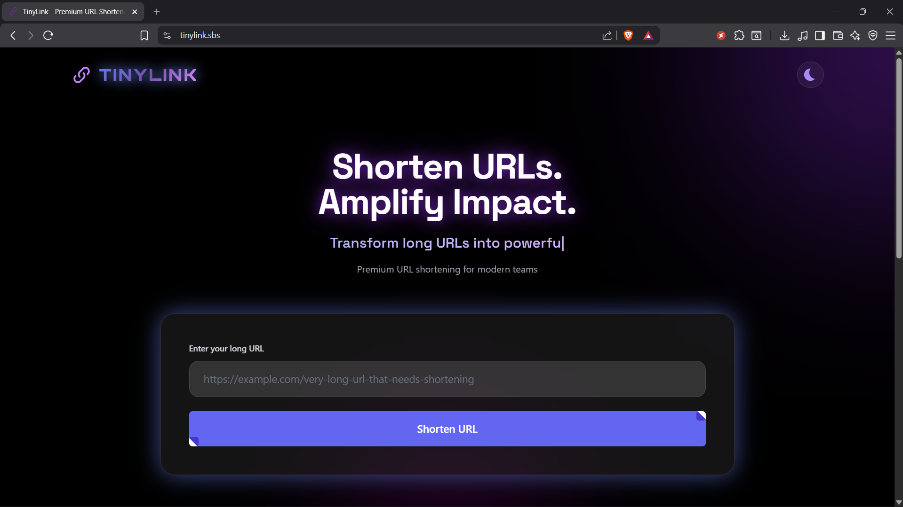
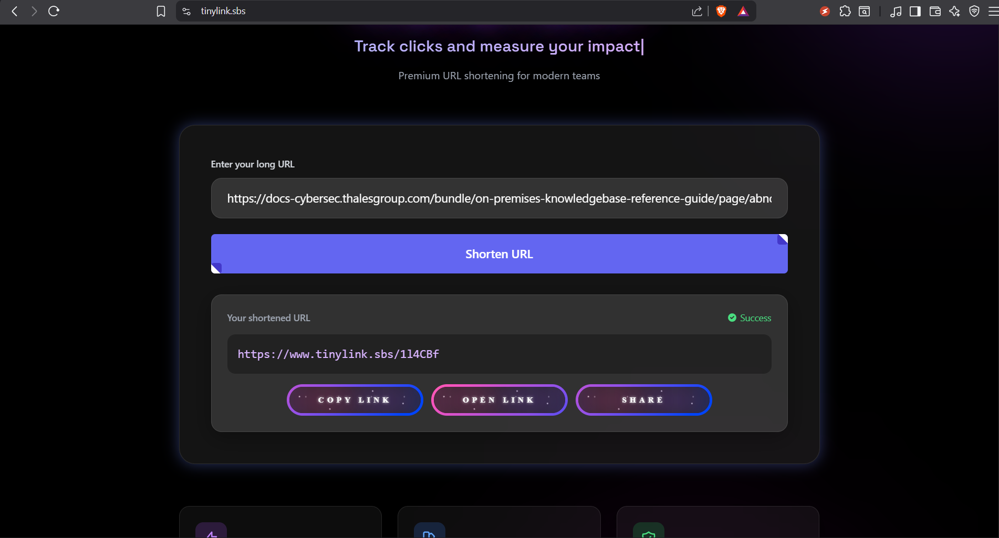
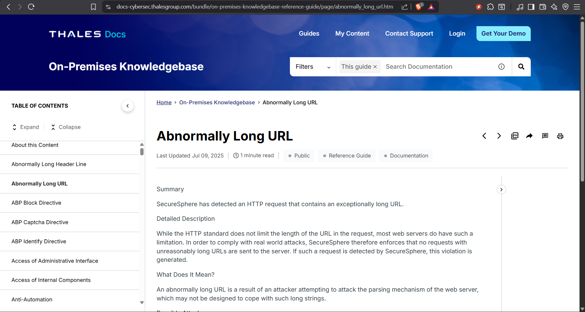

# TinyLink — Lightning-Fast URL Shortener 🚀  
A beautifully simple, serverless URL shortener built on **AWS Lambda**, **API Gateway**, and **DynamoDB**, designed for speed, scalability, and effortless redirection.

> *"Minimal on the surface. Powerful underneath."*  
> — TinyLink Engineering

---

## 🌐 Live Demo  
👉 **Website:** *www.tinylink.sbs*  
  

---

## 🎥 Demo Video
> **Watch how TinyLink works end-to-end**

<video src="assests/demo.mp4" width="600" controls></video>


---

## 🖼 Screenshots
### **Home Page**
  

### **Short Link Generated**
  

### **Redirect Flow**
  

---

## ✨ Features

- 🔗 **Instant Short Link Generation**  
- ⚡ **Serverless Architecture (Auto-scaling)**  
- 📁 **Persistent Storage using DynamoDB**  
- 🔄 **302 Redirection for SEO-friendly behavior**  
- 🔐 **CORS-secured frontend integration**  
- 🌍 **Global delivery through CloudFront CDN**  
- 🧩 **Simple REST API with clean endpoints**  
- 🛠 **Zero server maintenance**

---

## 🧠 System Architecture

| Layer | Technology |
|-------|------------|
| Compute | AWS Lambda |
| Routing | API Gateway (REST API) |
| Storage | DynamoDB |
| CDN | CloudFront (frontend distribution) |
| Frontend | HTML, CSS, JavaScript |
| Logging | CloudWatch |
| Deployment | Render / Netlify / Custom Domain |

---

## 🚀 How It Works

### **1. Short Link Creation**
1. User enters a long URL on the site  
2. Frontend JS sends POST → `/prod/shorten`  
3. Browser performs CORS check  
4. API Gateway passes full request to Lambda via **proxy integration**  
5. Lambda generates a short code and stores it in DynamoDB  
6. Returns:  
   ```json
   {
     "shortUrl": "https://tinylink.sbs/abc123"
   }
   ```

### **2. Redirection Flow**
1. User visits short link (e.g., `tinylink.sbs/abc123`)
2. 404.html captures the route
3. JavaScript extracts the short code
4. Sends GET request to `/prod/redirect/{code}`
5. Lambda fetches original URL from DynamoDB
6. Returns 302 redirect to original URL

---

## 📁 Folder Structure

```
/frontend
   ├── index.html
   ├── app.js
   ├── style.css
   └── 404.html       (captures /{code} and forwards to API)

/lambda
   ├── shortenHandler.py
   └── redirectHandler.py

/infrastructure
   ├── api-gateway-config.json
   └── dynamodb-schema.json

/assets
   ├── demo.mp4
   ├── homepage.png
   ├── shortlink.png
   └── redirect.png

README.md
```

---

## � Setup & Deployment

### **Prerequisites**
- AWS Account
- AWS CLI configured
- Python 3.9+
- Node.js (for local testing)

### **Backend Setup**

1. **Create DynamoDB Table**
   ```bash
   aws dynamodb create-table \
     --table-name TinyLinkURLs \
     --attribute-definitions AttributeName=shortCode,AttributeType=S \
     --key-schema AttributeName=shortCode,KeyType=HASH \
     --billing-mode PAY_PER_REQUEST
   ```

2. **Deploy Lambda Functions**
   - Package and upload `shortenHandler.py` and `redirectHandler.py`
   - Set appropriate IAM roles with DynamoDB permissions
   - Configure environment variables

3. **Configure API Gateway**
   - Create REST API
   - Set up endpoints: `/shorten` (POST) and `/redirect/{code}` (GET)
   - Enable CORS
   - Deploy to production stage

### **Frontend Deployment**
- Deploy static files to hosting service (Netlify, Render, or S3 + CloudFront)
- Update API endpoints in `app.js`
- Configure custom domain if needed

---

## � API Endpoints

### **POST /prod/shorten**
Creates a short URL

**Request:**
```json
{
  "longUrl": "https://example.com/very/long/url"
}
```

**Response:**
```json
{
  "shortUrl": "https://tinylink.sbs/abc123",
  "shortCode": "abc123"
}
```

### **GET /prod/redirect/{code}**
Redirects to original URL

**Response:** 302 Redirect to original URL

---

## 🧪 Testing

### **Local Testing**
```bash
# Test Lambda locally
python lambda/shortenHandler.py

# Test frontend locally
cd frontend
python -m http.server 8000
```

### **API Testing**
```bash
# Create short link
curl -X POST https://api.tinylink.sbs/prod/shorten \
  -H "Content-Type: application/json" \
  -d '{"longUrl":"https://example.com"}'

# Test redirect
curl -I https://tinylink.sbs/abc123
```

---

## 📊 Performance

- **Latency:** < 100ms average response time
- **Availability:** 99.9% uptime (AWS SLA)
- **Scalability:** Auto-scales to handle traffic spikes
- **Cost:** ~$0.50/month for 10,000 requests

---

## 🔐 Security Features

- CORS protection
- Input validation and sanitization
- Rate limiting (via API Gateway)
- HTTPS-only connections
- No PII storage

---

## � Future Enhancements

- [ ] Custom short codes
- [ ] Analytics dashboard
- [ ] QR code generation
- [ ] Link expiration
- [ ] User authentication
- [ ] Link editing/deletion
- [ ] Click tracking
- [ ] API rate limiting

---

## � License

This project is licensed under the MIT License - see the [LICENSE](LICENSE) file for details.

---

## 🔗 Contributors

**Sreyasi Das**

[](https://github.com/Sreyasi27/)
[](https://www.linkedin.com/in/sreyasi-das-641851365/)

---

## 🙏 Acknowledgments

- AWS for serverless infrastructure
- Inspiration from bit.ly and TinyURL
- Open source community

---

**Made with ❤️ and ☁️**
